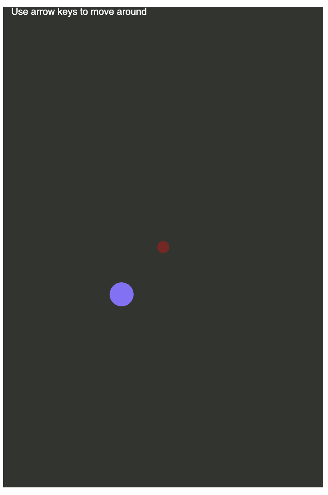
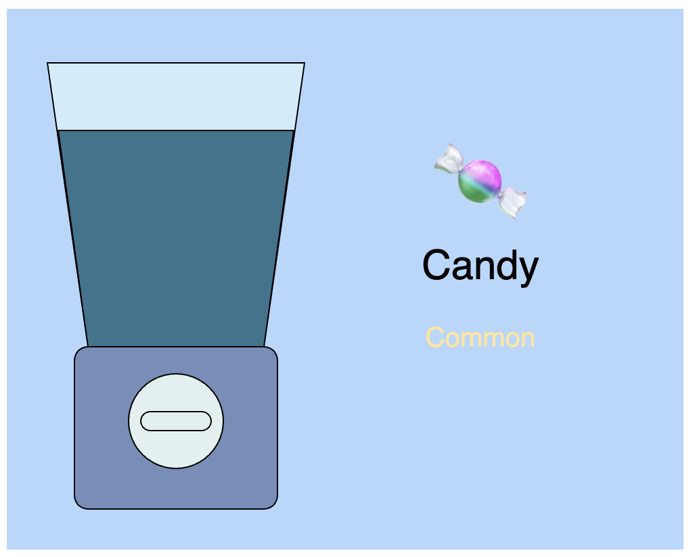
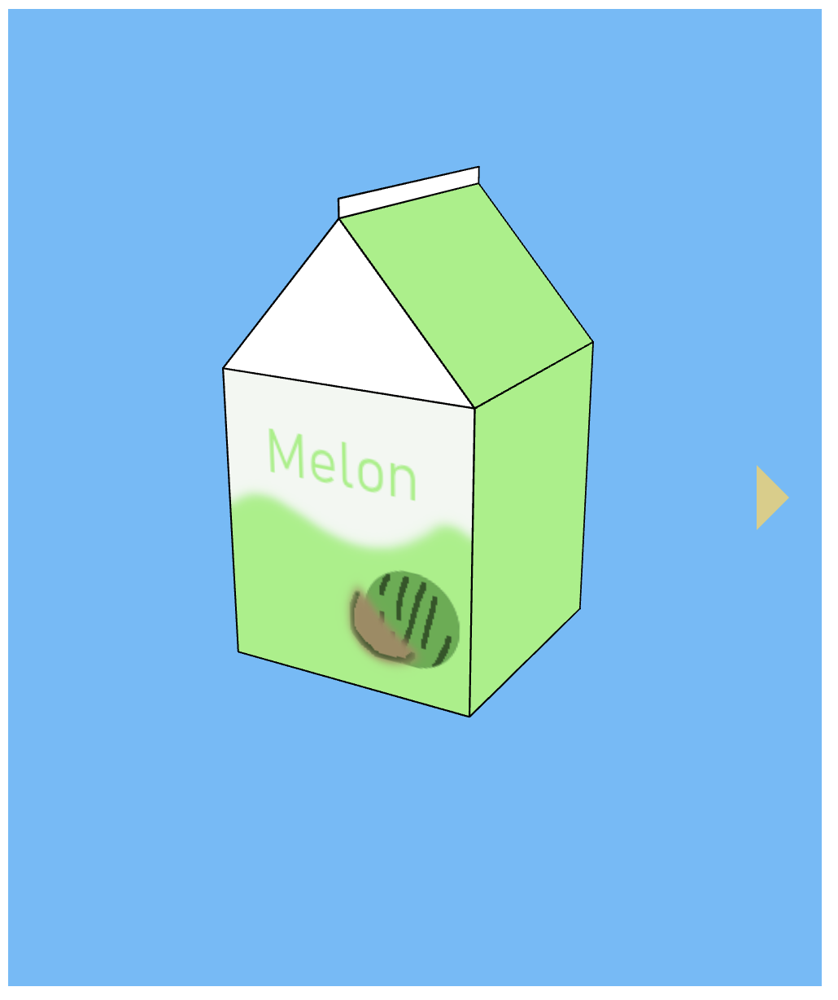
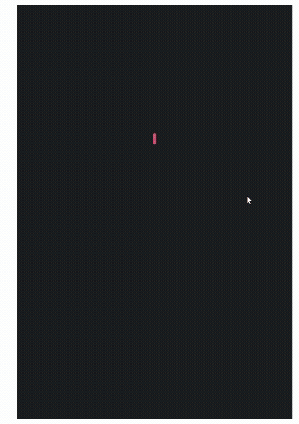
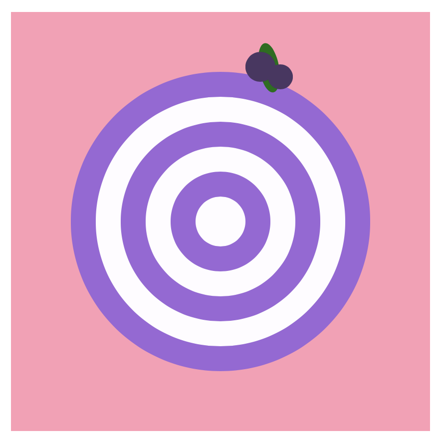
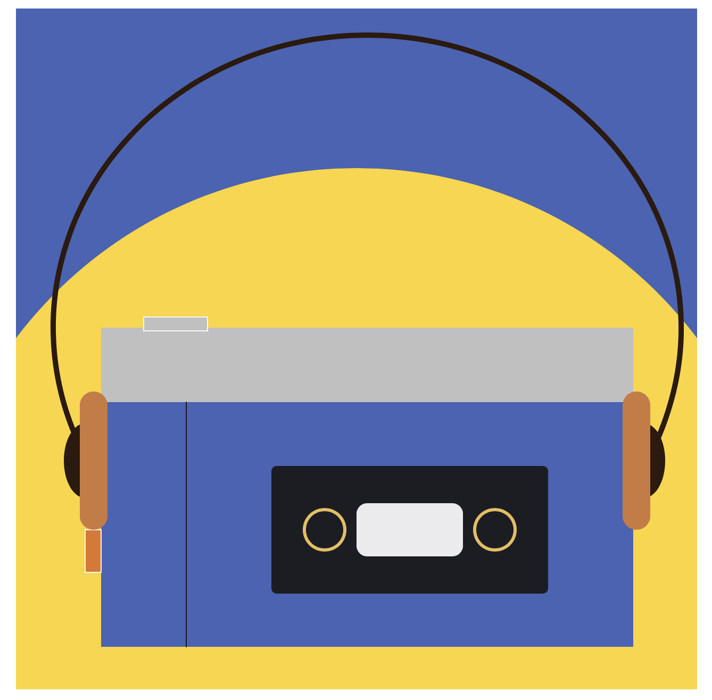
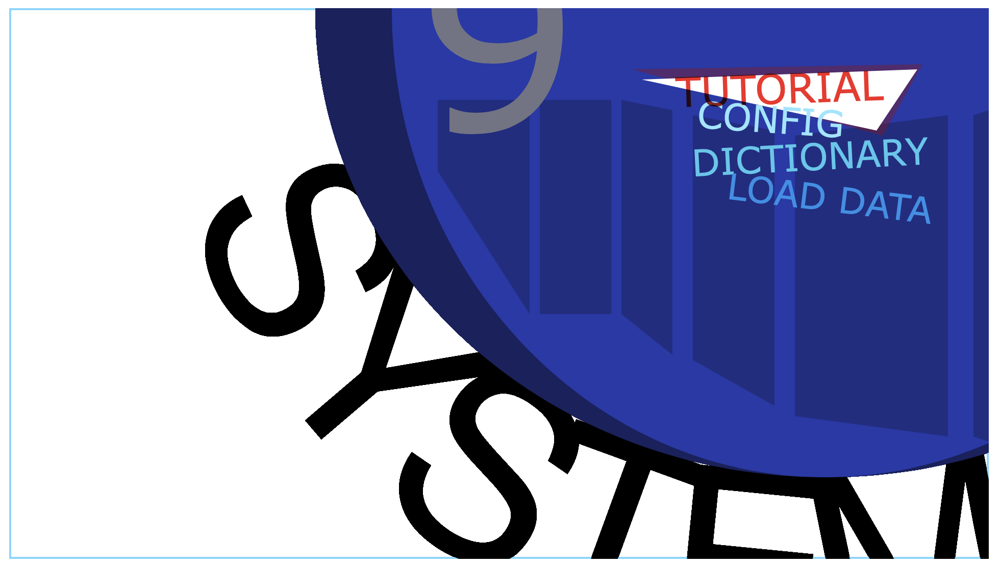

# Fun Stuff

🪴Interactive component under construction?

---

>This repo is to collect & show off my prototyping work in *CART253*.

## Link
[Current Week Journal](https://github.com/kikiisong/CART253_New/blob/main/journals/20261006.md)

[Reflective Journals](https://github.com/kikiisong/CART253_New/tree/main/journals)

## Prototype 
### Conditionals
#### Mushroooom

Collect the red yummy mushroom and the next one will appear.

[Page](https://kikiisong.github.io/CART253_New/prototypes/conditionals/mushroom/) | 
[Repo](https://github.com/kikiisong/CART253_New/tree/main/prototypes/conditionals/mushroom)

#### Gacha Machine

Turn(Click) the knob to test your luck!

[Page](https://kikiisong.github.io/CART253_New/prototypes/conditionals/gacha-machine/) | 
[Repo](https://github.com/kikiisong/CART253_New/tree/main/prototypes/conditionals/gacha-machine)

#### Choose Ur Fighter (Flavored Milk Version)

Pick your fav fighter(flavor)!

[Page](https://kikiisong.github.io/CART253_New/prototypes/conditionals/choose-ur-fighter/) | 
[Repo](https://github.com/kikiisong/CART253_New/tree/main/prototypes/conditionals/choose-ur-fighter)

### Variables
#### Juicyyy

Click to add (enough distance) or remove (overlap) the orange juice.

[Page](https://kikiisong.github.io/CART253_New/prototypes/variables/juice/) | 
[Repo](https://github.com/kikiisong/CART253_New/tree/main/prototypes/variables/juice)

#### Let There Be Light

Click to change the size of the light.

[Page](https://kikiisong.github.io/CART253_New/prototypes/variables/light-in-the-dark/) | 
[Repo](https://github.com/kikiisong/CART253_New/tree/main/prototypes/variables/light-in-the-dark)

#### Fireworks

The mouse position will influence the color sometimes.

[Page](https://kikiisong.github.io/CART253_New/prototypes/variables/fireworks/) | 
[Repo](https://github.com/kikiisong/CART253_New/tree/main/prototypes/variables/fireworks)

### Instructions
#### Blueberry Swiss Roll

[Page](https://kikiisong.github.io/CART253_New/prototypes/instructions/blueberry-swiss-roll/) | 
[Repo](https://github.com/kikiisong/CART253_New/tree/main/prototypes/instructions/blueberry-swiss-roll)

#### SONY Walkman

[Page](https://kikiisong.github.io/CART253_New/prototypes/instructions/sony-walkman/) | 
[Repo](https://github.com/kikiisong/CART253_New/tree/main/prototypes/instructions/sony-walkman)

### Persona 3 UI

[Page](https://kikiisong.github.io/CART253_New/prototypes/instructions/persona-ui/) | 
[Repo](https://github.com/kikiisong/CART253_New/tree/main/prototypes/instructions/persona-ui)

## In-Class Exercise
[Version Control Page](https://kikiisong.github.io/CART253_New/topics/version-control/version-control-workflow/)

