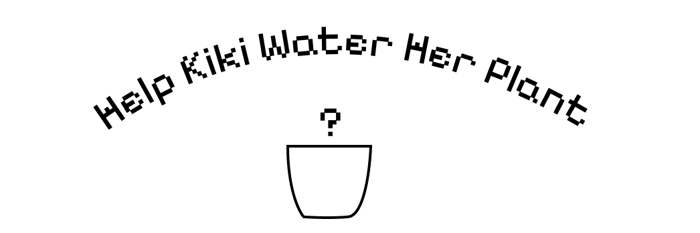

# Reflective Journel
## 2026.09.11
Since I'm already familiar with using GitHub, I wanted to learn/try something new. I wondered if there are ways to gamify a README within GitHub. To my surprise, there are. I stumbled upon this [repo](https://github.com/abhisheknaiidu/awesome-github-profile-readme#game-mode-) with a lot of cool examples. Basically, they are utilizing GitHub Actions to push changes to their repo after someone clicked on a CTA link. I wanted to do that for my little "water the plant" banner.

After reading some technical documentation, I decided not to go deeper into the coding rabbit hole. It's hacky, thus tedious to write. Ultimately, my goal is to shift my energy to the creative side instead of programming/execution, when possible.

I'd still like to add cute interactive elements here and there. I'll be on the lookout for a more fun way to implement those as we progress through the course.

